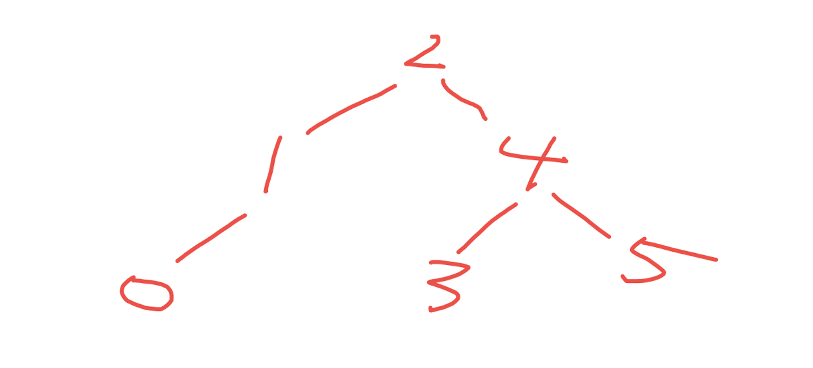
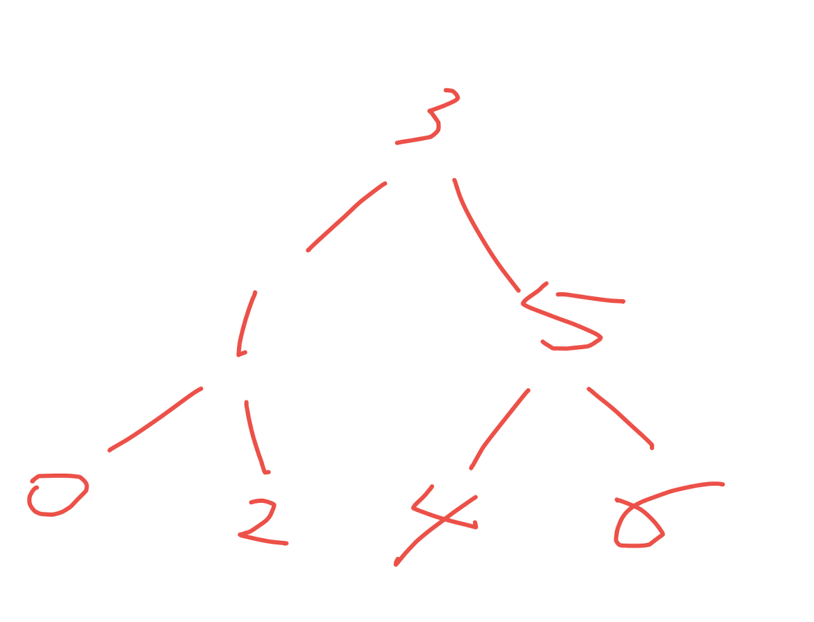

# 算法和SpringBoot

[toc]

## 一、算法

数据结构

| 数据结构           | 底层 |
| ------------------ | ---- |
| 数组、链表         |      |
| 二叉树、二叉搜索树 |      |
| 图                 |      |
| 哈希表             |      |


### 1.1 树

#### （1）链表：用数组创建一个循环链表

使用数组创建一个可循环使用的链表。

[MyQueue](https://gitee.com/lf-ren/java-re-new-builder/blob/master/projects/pro02Java8/src/main/java/com/hef/algorithm/MyQueue.java)

####  （2）二分查询树

[二分查询树](https://gitee.com/lf-ren/java-re-new-builder/blob/master/projects/pro03Algorithm/src/main/java/com/hef/tree/BinarySearchTree.java)

#### （3）  AVL树：平衡二叉树

[平衡二叉树](https://gitee.com/lf-ren/java-re-new-builder/tree/master/projects/pro03Algorithm/src/main/java/com/hef/tree/AVLTree.java)，关键是左旋和右旋的操作：

```
    /**
     * 向左旋转
     * @param h
     * @return
     */
    public Node rotateLeft(Node h) {
        Node x = h.right;
        h.right = x.left;
        x.left = h;
        x.N = h.N;
        h.N = size(h.left) + size(h.right) + 1;
        return x;
    }
    
    /**
     * 向右旋转
     * @param h
     * @return
     */
    public Node rotateRight(Node h) {
        Node x = h.left;
        h.left = x.right;
        x.right = h;
        x.N = h.N;
        h.N = size(h.left) + size(h.right) + 1;
        return x;
    }
```





#### （4） 红黑树

[平衡查询树：从2-3 search Tree 到 红黑树](https://gitee.com/lf-ren/java-re-new-builder/blob/master/document/2021-09-22-%E5%B9%B3%E8%A1%A1%E6%9F%A5%E8%AF%A2%E6%A0%91%EF%BC%9A%E4%BB%8E2-3%20search%20Tree%20%E5%88%B0%20%E7%BA%A2%E9%BB%91%E6%A0%91.md)

### 1.2 动态规划

#### （1）斐波拉契序列

#### （2）凑零钱问题

## 二、SpringBoot


