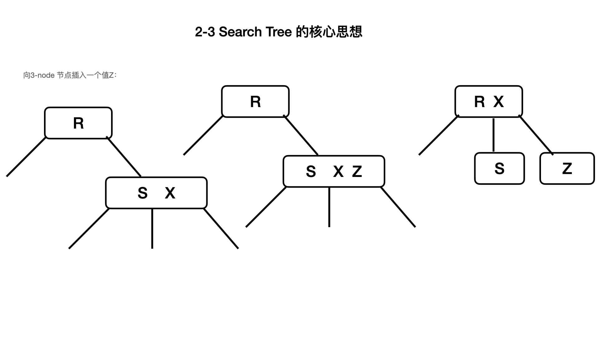

# 平衡查询树：2-3 search Tree

[toc]

## 一、2-3 查询树的定义

- 2-node： 有一个key（关联着value），带有两个链；
- 3-node： 有两个key（关联着value），带有三个链；

2-3 查询树，有空节点，或有 2-nodes节点，或有3-nodes节点。

**完美的平衡二叉树(perfectly balanced 2-3 search tree)：** 所有的空节点到根节点到距离相等。***为了简洁，用“2-3 tree” 指代“perfectly balanced 2-3 search tree”。***

##  二、2-3 叉树的关键思想

