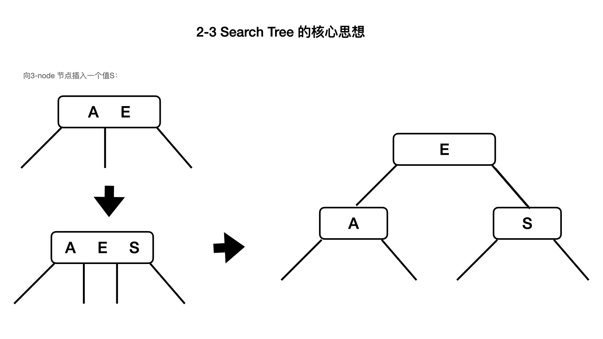
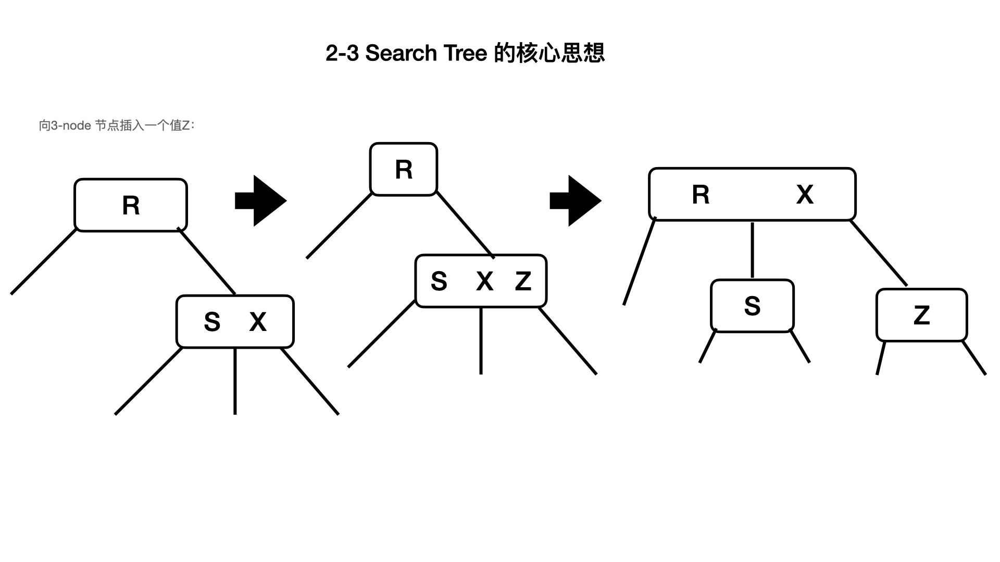
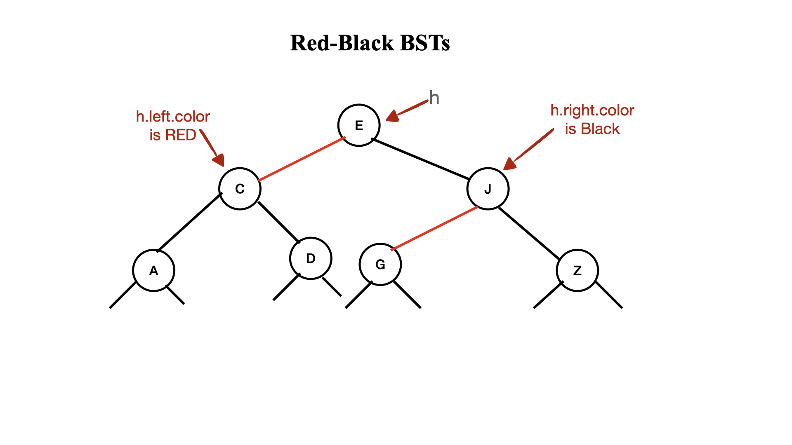
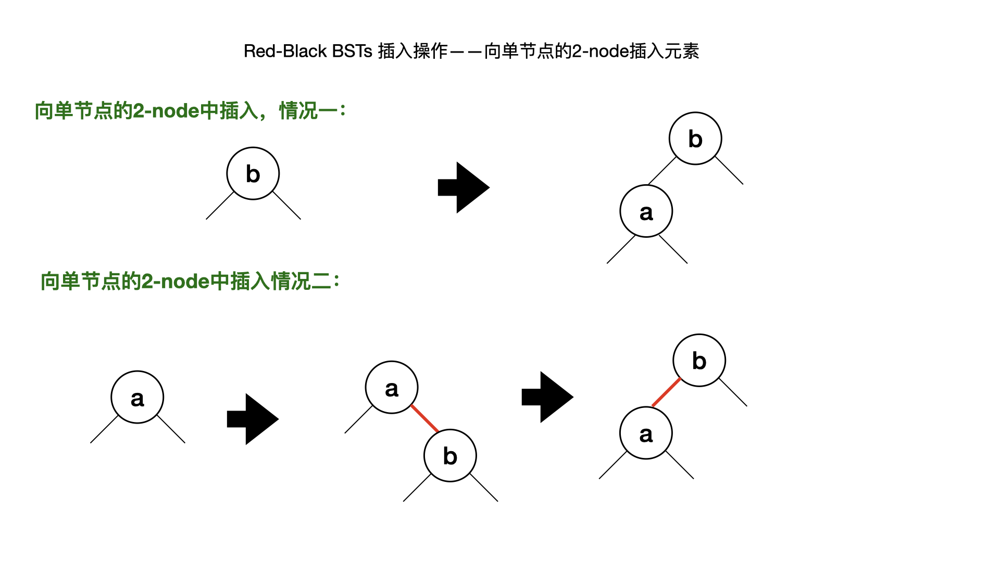
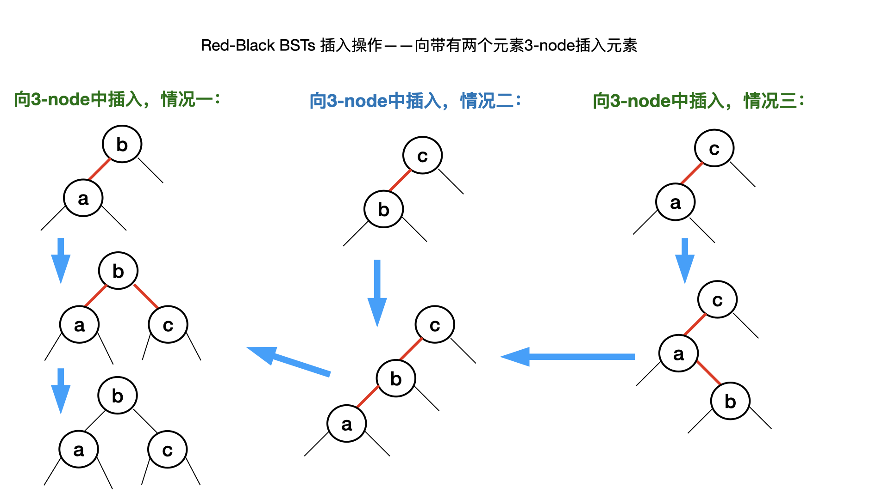

# 平衡查询树：2-3 search Tree

[toc]

## 一、2-3 查询树的定义

- 2-node： 有一个key（关联着value），带有两个链；
- 3-node： 有两个key（关联着value），带有三个链；

2-3 查询树，有空节点，或有 2-nodes节点，或有3-nodes节点。

**完美的平衡二叉树(perfectly balanced 2-3 search tree)：** 所有的空节点到根节点到距离相等。***为了简洁，用“2-3 tree” 指代“perfectly balanced 2-3 search tree”。***


##  二、2-3 叉树的关键思想

- 不像二分查询树（BST）是从顶部往下增长，2-3 tree 是从底部开始长高；
- 向2-3tree 插入或查询key。时间复杂度为O(lgN)
- 





## 三、红黑树：Red-black BSTs

红黑树是**2-3 tee** 的一种实现。

### 3.1 表示 3-node

基于标准的BSTs（二分查询树），添加额外的信息，将其变成 3-nodes。

两种类型的链：

- 红色链：连接两个**2-node**节点，代表**3-node**
- 黑色链：黑色的链，连接着**2-3 tree**
- ***特别指出：*** 我们用两个相连的**2-node**节点，带有红链标识，表示**3-node**。其中一个**2-node** 是另一个**2-node**的左孩子。

### 3.2 颜色的表示

为节点添加一个属性：`boolean color`

- 如果从父链接指向它的链接是红色，那么color=true;
- 如果从父链接指向它的链接是黑色，那么color=false；
- 约定：NULL链是黑色；当我们说一个节点的颜色，我们是说那个链指向这个节点的颜色；



### 3.,3 旋转操作和翻转颜色

在实现Red-Black BSTs 的过程中，我们可能会允许红链（red links）右倾斜（right-leaning），或者两条红链在一行上。在我们完成之前，通过旋转能够纠正这种问题。

#### （1）左旋操作：left rotation

假设有一个右倾的红链，需要左旋让其变为左倾：

```
    /**
     * 左旋操作
     * @param h
     * @return
     */
    public Node rotateLeft(Node h) {
        Node x = h.right;
        h.right = x.left;
        x.left = h;
        x.color = h.color;
        h.color = RED;
        x.N = h.N;
        h.N = size(h.left) + size(h.right) + 1;
        return x;
    }
```

#### （2）右旋操作

假设有一个左倾的红链，需要右旋让其变为右倾。

```
    /**
     * 右旋操作
     * @param h
     * @return
     */
    public Node rotateRight(Node h) {
        Node x = h.left;
        h.left = x.right;
        x.right = h;
        x.color = h.color;
        h.color = RED;
        x.N = h.N;
        h.N = size(h.left) + size(h.right) + 1;
        return x;
    }
```

#### （3）翻转颜色

```
    /**
     * 翻转颜色，将两个红节点的子节点，变为黑色节点
     * @param h
     */
    public void flipColors(Node h) {
        h.color = RED;
        h.left.color = BLACK;
        h.right.color = BLACK;
    }
```

#### （4）几种基本的插入操作

通过零次、一次或二次旋转，再对根的两个孩子翻转颜色，达到我们想要的结果。






### 3.4 保持根节点的颜色为黑色

- 保持根节点的颜色为黑色；
- 无论任何时候，根节点的颜色从黑色变成红色，树的黑色高加1；

### 3.5 代码实现

[RedBlackBST](https://gitee.com/lf-ren/java-re-new-builder/tree/master/projects/pro03Algorithm/src/main/java/com/hef/tree/RedBlackBST.java)

```
    /**
     * 插入操作
     * @param key
     * @param val
     */
    public void put(Key key, Value val) {
        root = put(root, key, val);
        // 保证根节点为黑色
        root.color = BLACK;
    }

    /**
     * 向节点插入元素
     * @param node
     * @param key
     * @param val
     * @return
     */
    public Node put(Node node, Key key, Value val) {
        if (node==null) {
            return new Node(key, val, 1, RED);
        }

        int com = key.compareTo(node.key);
        if (com==0) node.val = val;
        else if (com>0) node.right = put(node.right, key, val);
        else node.left = put(node.left, key, val);
        // 旋转和翻转颜色
        if (isRed(node.right) && !isRed(node.left)) node = rotateLeft(node);
        if (isRed(node.left) && isRed(node.left.left)) node = rotateRight(node);
        if (isRed(node.left) && isRed(node.right)) flipColors(node);

        node.N = size(node.left) + size(node.right) + 1;
        return node;
    }
```

